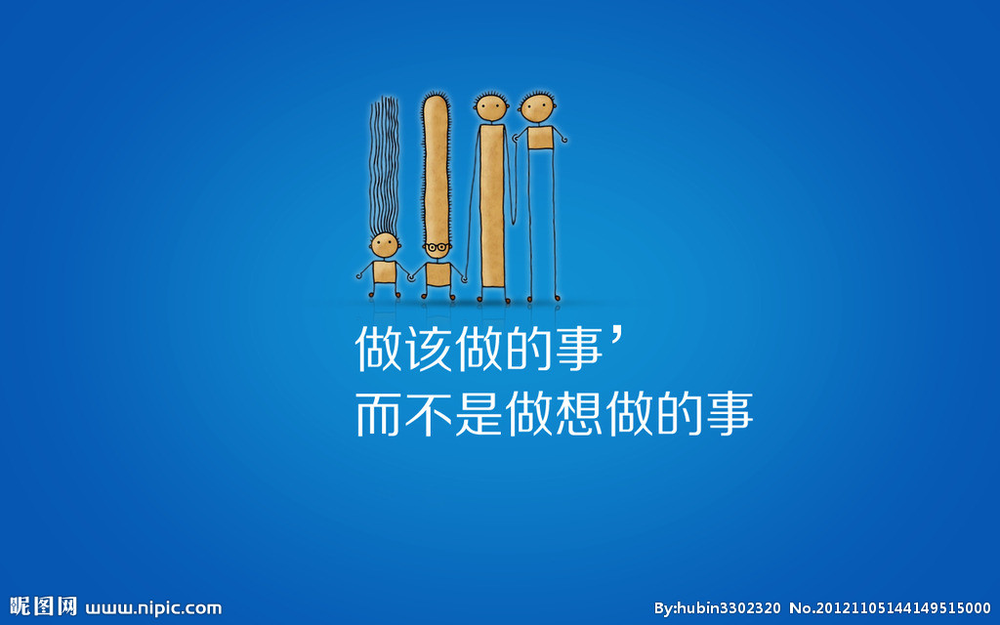

<!DOCTYPE html>
<html lang="en">
<head>
  <meta charset="utf-8">
  <title>这是我做的第一个能网上浏览的网页</title>
</head>
<body>
 
  
今天我终于有了电脑

  
但是电脑里还什么都没有

  
刚用这个软件，还没学会插图

  
相信我以后会越做越好的

  
--

   
耶(＾－＾)V

   
--

</body>
</html>
